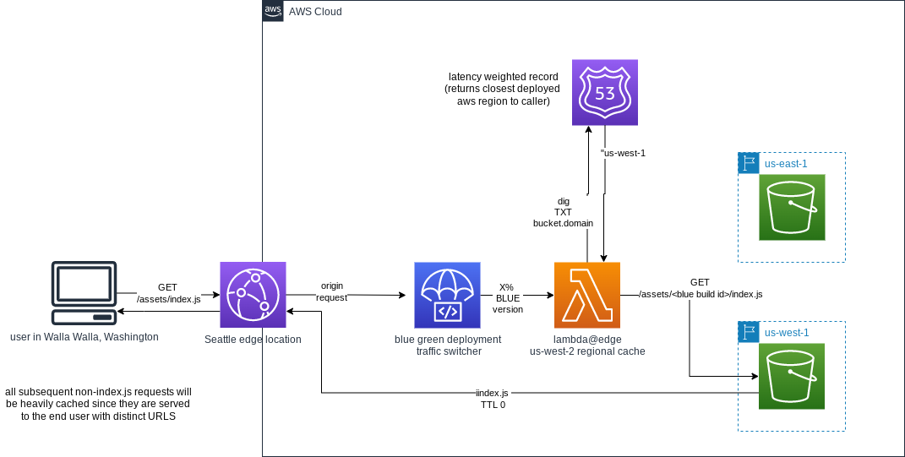

# blue-green-static-aws-edge

### This reference architecture has been provided by [BASED EDGE LLC](https://basededge.dev)

## WHAT
This repo contains a sample reference AWS CDK stack for setting up a [blue green](https://docs.aws.amazon.com/whitepapers/latest/overview-deployment-options/bluegreen-deployments.html) deployed [serverless](https://aws.amazon.com/serverless/) distribution.

A sample React javascript application is (async) chunked by webpack with a distinct *buildId* included in the [publicPath](https://webpack.js.org/guides/public-path/). The cdk stack deploys the web assets to S3 (using the buildId as a the subfolder) as well as update the edge lambda to a new version with the latest *buildId*. AWS Code Deploy then slowly switches traffic b/w the old lambda and the new lambda. As users visit the page, they will be progressively more likely to see the new version over the old version until the deployment successfully completes. To reduce origin latency for users far away from us-east-1, a route53 latency based TXT record is used to redirect the s3Origin request to the closet s3 bucket (that contains all the same assets).

If something were to go wrong with the latest assets, (ie: code bug), the code deployment would fail and revert to the old version. Since the javascript entry should never be cached, any users who were served the bad version will get the old version after reloading the page. The same rollback action could be manually performed if an issue was discovered after the deployment completed.

The major down side with this approach is having to invoke a lambda  every time a user loads the widget. This can lead to incurring Lambda costs, depending the level of traffic the app receives. These costs can be lower (or more operationally acceptable) than running comparable server(s) 24/7.

Another issue is incurring addition costs from always having to fetch the *index.js*. This will incur a financial cost in terms of S3 GET requests as well as a performance cost of always having to fetch the asset from us-east-1 (the sample client app aggressively asynchronously loads everything in the index to minimize its size at build time and ensure that most of the app is cached at the edge by CloudFront). Using [Route53 latency routing](https://docs.aws.amazon.com/Route53/latest/DeveloperGuide/routing-policy.html#routing-policy-latency), the edge lambda was upgraded to redirect the origin request to the closest aws region + replicated bucket, to reduce distance based latency. Yet again, this introduces more (possible) line items to the AWS bill in terms of additional [storage costs](https://aws.amazon.com/s3/pricing/) and [DNS queries](https://aws.amazon.com/route53/pricing/#Queries), but these *should be* pretty minor.


Alternatively, a hybrid or all-in  approach with Cloudflare R2 could be considered.


### live demo
[HERE](https://d2prqirr6xh077.cloudfront.net)

## HOW


### AWS Services used
- [Lambda@Edge](https://aws.amazon.com/lambda/edge/)
- [S3](https://aws.amazon.com/s3/)
- [CloudFront](https://aws.amazon.com/cloudfront/)
- [CodeDeploy](https://aws.amazon.com/codedeploy/)
- [Route53](https://aws.amazon.com/route53)
- Cloudwatch (coming soon)

## WHY
For engineers that need to deploy javascript applications to many sites that they do not control, this is offered as one approach. Since they do not want to be beholden to many different deployment pipelines, this architecture allows them to deploy the javascript to a single distribution in a controlled and safe manner (slow rollout using blue green deployments ) and fully control the rollback if there were to be an issue without having to boss around all the different consumers.

Depending on an organization structure and/or priorities, host teams may not be interested in maintain a noticeable and ongoing operation cost of integrating your app into their site.

## HOW
0. install node 14+, set up local aws credentials for your test account
1. ```npm i``` to install all node js dependencies
2. ```npm run build``` to build local assets
3. ```npm run cdk synth``` to set up your aws account for use with CDK
4. edit *bin/main.ts* to provide your domain + supported regions
5. ```npm run cdk deploy '*-EdgeBucket``` to create the edge buckets
6. ```npm run cdk deploy MainStack``` to deploy the cdk stack and web assets (this should take some time due to cloudfront distribution creation time). 
7. edit *bin/main.ts* again to provide the generated cloudfront origin access id for the s3 buckets
8. ```npm run cdk deploy '*-EdgeBucket``` to grant cloudfront access to the buckets

## NEXT
### v2
- basic post back metrics for alarms (have webapp have generate metrics for rollback alarm)
- client side alarm api gateway
- rollback alarm on deployment

### v3 (done)
copy assets to bucket closer to the edge, use route53 latency record to find closet to edge lambda, and redirect request to there 

### v4 
automated clean up of old assets
pre-gzip web assets before upload to reduce traffic from s3 to cloudfront edge (need to see if s3 already does this?)

### v5
health check for s3 endpoint to allow redirecting traffic away from aws regions currently on fire (look at you, us-east-1).